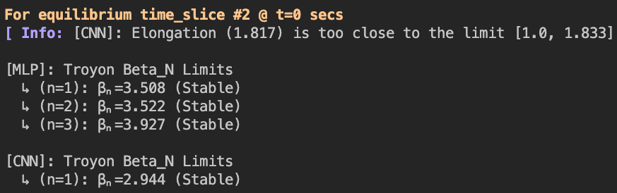

# TroyonBetaNN.jl

[](https://github.com/mgyoo86/TroyonBetaNN.jl/actions/workflows/CI.yml?query=branch%3Amain)


<!-- ABOUT THE PROJECT -->
## About the Package
This package uses pre-trained neural network (NN) models to predict Troyon (no-wall) $\beta_\mathrm{N}$ limits for a given equilibrium.
There are two different NN models with either MLP or CNN architectures, whose training dataset were generated with the [CHEASE](https://doi.org/10.1016/0010-4655(92)90167-W) and [MARS-F](https://doi.org/10.1063/1.1287744) codes for the equilibrium and MHD stability, respectively.
This package employs the pre-trained NN models and provides some useful interfaces to make it compatible with the IMAS data structure and [**FUSE**](https://github.com/ProjectTorreyPines/FUSE.jl) [](https://github.com/ProjectTorreyPines/FUSE.jl) ecosystem.

## About the NN models
Note that the following two models are each valid for a specific range of plasma parameters (e.g., aspect ratio and shape).
For example, the MLP model can cover a wider range of aspect ratio ($A\in[1.3, 4.0]$), while the CNN model only targets a specific aspect ratio ($A \sim 2.74$) since it is designed for the HL-2M tokamak.
On the other hand, the MLP model can only hanlde the positive triangularity ($\sigma>0$), but the CNN model can deal with a range of triangularity ($\sigma \in [-0.6, 0.8]$), including the negative triangularity.

### 1. MLP (Multi-Layer Perceptron) model
Developed and trained by Yueqiang Liu, *et al.*. (see [[Y.Q. Liu, *et al.*, *PPCF* (2020)]](https://doi.org/10.1088/1361-6587/ab6f56) for details).
This model can cover a wider range of plasma parameters
* Input
    * 2D boundary shape
    * 1D safety factor
    * 1D plasma pressure
* Output
    * Troyon $\beta_\mathrm{N}$ limits for $n=(1,2,3)$ toroidal modes

### 2. CNN (Convolutional Neural Network) model
Developed and trained by Yifei Zhao, *et al.*. (see [[Y.F. Zhao, *et al.*, *PPCF* (2022)]](https://doi.org/10.1088/1361-6587/ac4524) for details)
* Input
    * 2D boundary shape
    * 1D safety factor
    * 1D plasma pressure
    * Internal inductance ($l_i$)
    * Pressure Peaking Factor (PPF)
* Output
    * Troyon $\beta_\mathrm{N}$ limit for $n=1$ toroidal mode


## Quick Examples
```julia
# Assuming that "FUSE" and "dd" are already in your scope

import TroyonBetaNN as TBNN

# The following function cacluates Troyon limits for all equilibrium time_slices in dd,
# and returns Vector{Troyon_Data}, which has all information about the result
TD_vec = TBNN.Calculate_Troyon_beta_limits_for_IMAS_dd(dd); # To iterate

# Or one can specify a time_slice of equilibrium and calculate Troyon limits for it,
# which returns a single "Troyon_Data" struct
eqt = dd.equilibrium.time_slice[2];
TD = TBNN.Calculate_Troyon_beta_limits_for_a_given_time_slice(eqt);
```
The above functions show a simple terminal output about Troyon $\beta_N$ limits.
<br />
<div align="center">
    
</div>
<br />

One can get more verbose information by adding a keyword argument "verbose=true".
```julia
# For all time_slices
TD_vec = TBNN.Calculate_Troyon_beta_limits_for_IMAS_dd(dd; verbose=true);

# Or, for a specific time_slice
eqt = dd.equilibrium.time_slice[2];
TD = TBNN.Calculate_Troyon_beta_limits_for_a_given_time_slice(eqt; verbose=true);
```
This will give the following verbose terminal output and write figure file of sampling points used for NN.
<br />
<div align="center">
    
</div>
<br />


Sample points for a FPP equilibrium:
<br />
<div align="center">
    
</div>
<br />


<!-- CONTACT -->
## Contact
Min-Gu Yoo [](https://www.linkedin.com/in/min-gu-yoo-704773230) (General Atomics)  yoom@fusion.gat.com \
Yueqiang Liu (General Atomics) liuy@fusion.gat.com


## Acknowledgments
We acknowledge Yeifei Zhao (Dalian University of Technology; <zhaoyifei@swip.ac.cn>) for graciously providing the trained CNN models for this project.

## References

* **[MLP model]**\
 Yueqiang Liu, Lang Lao, Li Li, and A D Turnbull, *Plasma Phys. Control. Fusion* **62** (2020) 045001 \
   ["Neural network based prediction of no-wall βN limits due to ideal external kink instabilities"](https://doi.org/10.1088/1361-6587/ab6f56)

* **[CNN model]**\
 Y F Zhao, Y Q Liu, S Wang, G Z Hao, Z X Wang, Z Y Yang, B Li, J X Li, H T Chen, M Xu, and X R Duan,  *Plasma Phys. Control. Fusion* **64** (2022) 045010 \
["Neural network based fast prediction of βN limits in HL-2M"](https://doi.org/10.1088/1361-6587/ac4524)

* **[CHEASE code]**\
H. Lütjens, A. Bondeson, and A. Roy, *Comput. Phys. Commun.* **69**  (1992) 287 \
["Axisymmetric MHD equilibrium solver with bicubic Hermite elements"](https://doi.org/10.1016/0010-4655(92)90167-W)

* **[MARS-F code]**\
Y. Q. Liu, A. Bondeson, C. M. Fransson, B. Lennartson, and C. Breitholtz,
*Phys. Plasmas* **7** (2000) 3681 \
["Feedback stabilization of nonaxisymmetric resistive wall modes in tokamaks. I. Electromagnetic model"](https://doi.org/10.1063/1.1287744)


<!-- <p align="right">(<a href="#readme-top">back to top</a>)</p> --j>