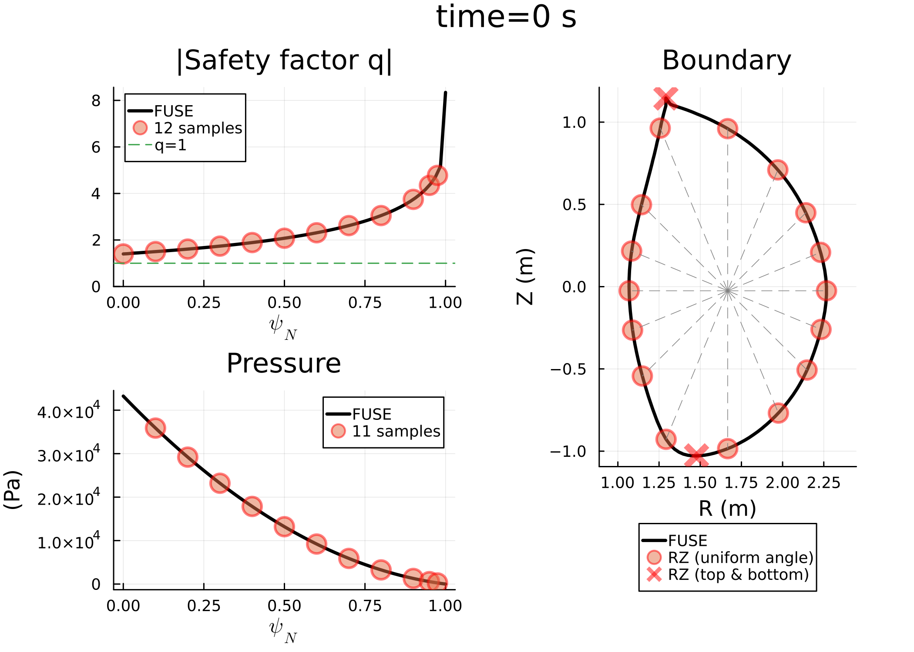

# TroyonBetaNN.jl

[](https://github.com/mgyoo86/TroyonBetaNN.jl/actions/workflows/CI.yml?query=branch%3Amain)


<!-- ABOUT THE PROJECT -->
## About The Package
This package uses a pre-trained neural network (NN) to predict Troyon (no-wall) $\beta_N$ limits for a given equilibrium specified by sampling a few points on 2D plasma boundary and 1D profiles of the equilibrium safety factor and plasma pressure.
Note that the NN model was developed and trained by Yueqiang Liu, *et al.*, where the MHD stability was analyzed by MARS-F code (see [[Y.Q. Liu, *et al.*, *PPCF* (2020)]](https://doi.org/10.1088/1361-6587/ab6f56) for details).
This package employs the pre-trained NN model and provides some useful interfaces to make it compatible with the IMAS data structure and FUSE ecosystem.


### Quick Examples
```julia
# Assuming that "FUSE" and "dd" are already in your scope

using TroyonBetaNN

TBNN = TroyonBetaNN

# The following function cacluates Troyon limits for all equilibrium time_slices in dd,
# and returns Vector{Troyon_Data}, which has all information about the result
TD_vec = TBNN.Calculate_Troyon_beta_limits_for_IMAS_dd(dd); # To iterate

# Or one can specify a time_slice of equilibrium and calculate Troyon limits for it,
# which returns a single "Troyon_Data" struct
eqt = dd.equilibrium.time_slice[2];
TD = TBNN.Calculate_Troyon_beta_limits_for_a_given_time_slice(eqt);
```
The above functions show a simple terminal output about Troyon $\beta_N$ limits.
<br />
<div align="center">
    
</div>
<br />

One can get more verbose information by adding a keyword argument "verbose=true".
```julia
# For all time_slices
TD_vec = TBNN.Calculate_Troyon_beta_limits_for_IMAS_dd(dd; verbose=true);

# Or, for a specific time_slice
eqt = dd.equilibrium.time_slice[2];
TD = TBNN.Calculate_Troyon_beta_limits_for_a_given_time_slice(eqt; verbose=true);
```
This will give the following verbose terminal output and write figure file of sampling points used for NN.
<br />
<div align="center">
    
</div>
<br />


Sample points for a FPP equilibrium:
<br />
<div align="center">
    
</div>
<br />


<!-- CONTACT -->
## Contact
Min-Gu Yoo [](https://www.linkedin.com/in/min-gu-yoo-704773230) (General Atomics)  yoom@fusion.gat.com \
Yueqiang Liu (General Atomics) liuy@fusion.gat.com


<!-- ACKNOWLEDGMENTS -->
## References

* Yueqiang Liu, Lang Lao, Li Li, and A D Turnbull, *Plasma Phys. Control. Fusion* **62** (2020) 045001 \
   ["Neural network based prediction of no-wall βN limits due to ideal external kink instabilities"](https://doi.org/10.1088/1361-6587/ab6f56)
<!-- <p align="right">(<a href="#readme-top">back to top</a>)</p> -->